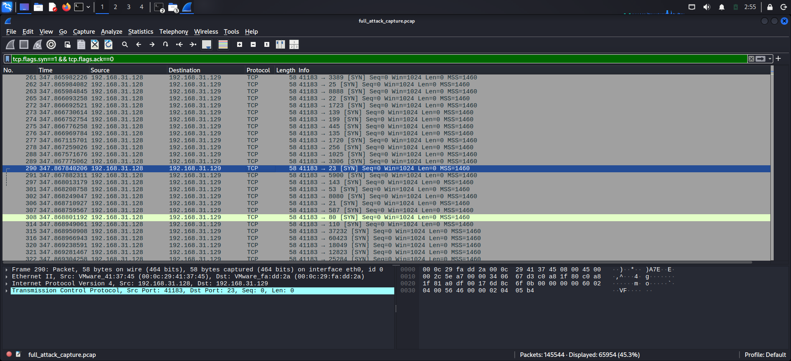
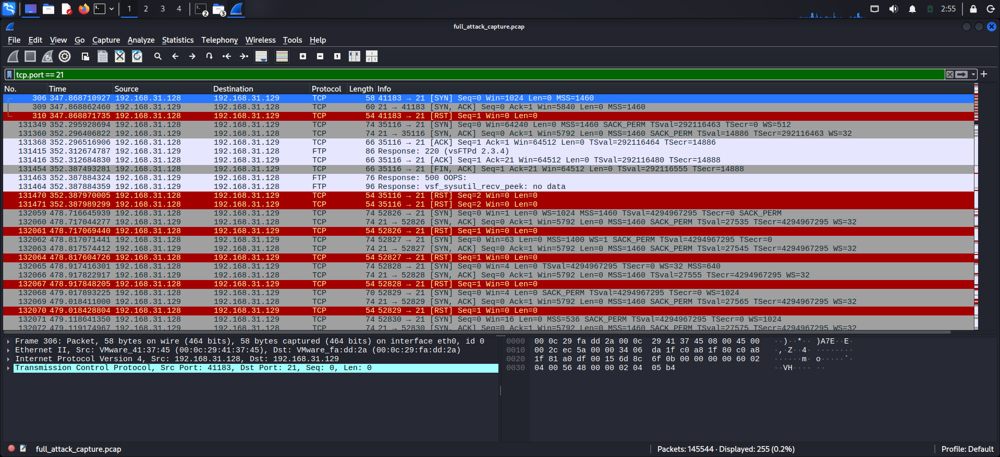
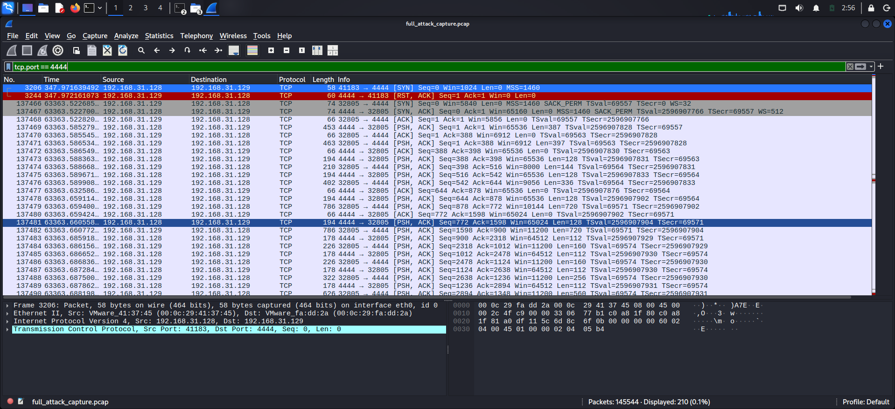
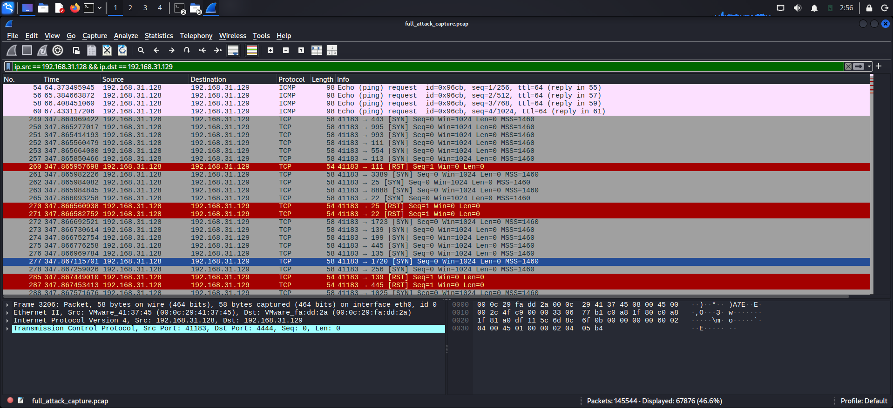
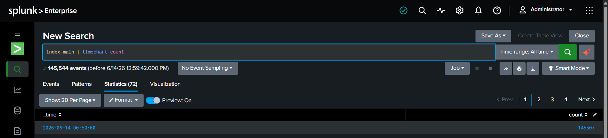
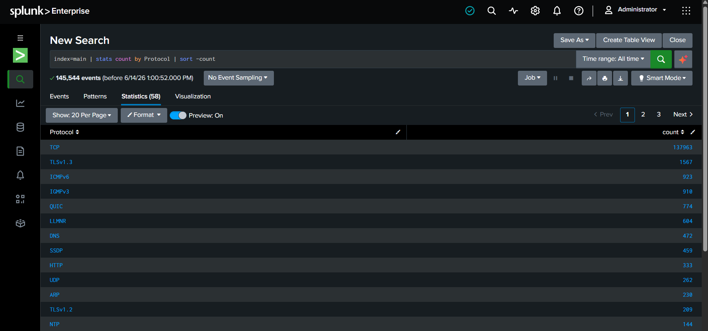
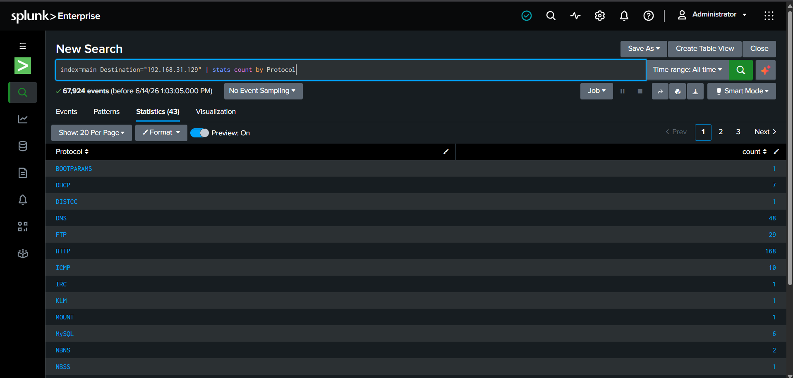

## Documentation

Full documented report: [GitBook Report](https://prajwal-1221.gitbook.io/security-notes/step-0-lab-setup/step-0-lab-setup)

---

```
## Section 1 — Executive Summary
```

```
A simulated penetration test and SOC investigation was conducted against an 
isolated lab environment running Metasploitable 2 as the target machine and 
Kali Linux as the attack machine.

The assessment identified two critical vulnerabilities:
- A backdoored FTP service (CVE-2011-2523) allowing unauthenticated root access
- An SQL injection flaw exposing all user credentials including password hashes

An attacker with network access could achieve full system compromise in under 
2 minutes. All attack traffic was captured via Wireshark and analyzed in 
Splunk SIEM. Immediate patching and input sanitization is recommended.
```

---

```
## Section 2 — Attack Timeline
```

```
| Phase          | Event                                      | Tool        | MITRE ID |
|----------------|--------------------------------------------|-------------|----------|
| Reconnaissance | Full port scan initiated on target          | Nmap        | T1046    |
| Reconnaissance | 20+ open ports and services identified      | Nmap        | T1046    |
| Exploitation   | VSFTPd backdoor module loaded               | Metasploit  | T1190    |
| Exploitation   | Meterpreter session opened on target        | Metasploit  | T1190    |
| Post-Exploit   | Root access confirmed on target system      | Meterpreter | T1033    |
| Post-Exploit   | OS and system info fingerprinted            | Meterpreter | T1033    |
| Post-Exploit   | /etc/passwd accessed — all users dumped     | Meterpreter | T1003    |
| Web Attack     | SQL injection payload submitted via DVWA    | Browser     | T1190    |
| Web Attack     | Full user table dumped from database        | Browser     | T1190    |
| Web Attack     | MD5 password hashes extracted via UNION     | Browser     | T1003    |
```

---

```
## Section 3 — Technical Findings
```

```
### Finding 1 — VSFTPd 2.3.4 Backdoor
- CVE: CVE-2011-2523
- Severity: Critical
- Port: 21 (FTP)

Description:
VSFTPd 2.3.4 contains a malicious backdoor introduced into its source code 
in 2011. Sending a username containing ":)" triggers a root shell. Exploited 
using Metasploit module unix/ftp/vsftpd_234_backdoor resulting in full 
Meterpreter session with root privileges.

Impact:
Full unauthenticated root access to the target system. Attacker can read, 
modify, or delete any file on the system.

Fix:
Upgrade VSFTPd to a patched version. Disable FTP entirely if not required.
```

```
### Finding 2 — SQL Injection
- CVE: CWE-89 / OWASP A03:2021
- Severity: Critical
- Port: 80 (HTTP)

Description:
The DVWA application does not sanitize user input in the SQL query. 
Payload ' OR 1=1# dumped all users from the database. 
Payload UNION SELECT user, password extracted MD5 password hashes.

Impact:
Full database contents exposed. MD5 hashes are easily crackable 
via tools like CrackStation.

Fix:
Use parameterized queries and prepared statements. Never concatenate 
user input directly into SQL queries.
```

---

```
## Section 4 — Detection Evidence
```

```
### Wireshark Evidence
```
```
Filter 1 — Port Scan Detection
Filter: tcp.flags.syn==1 && tcp.flags.ack==0
Finding: High volume of SYN packets from attacker machine — 
clear signature of an active port scan.
```


```
Filter 2 — FTP Connection
Filter: tcp.port == 21
Finding: TCP handshake to port 21 confirming FTP exploit attempt.
```


```
Filter 3 — Meterpreter Reverse Connection
Filter: tcp.port == 4444
Finding: Encrypted reverse TCP session established between attacker 
and target. Meterpreter encrypts post-exploitation traffic — 
exploitation confirmed via session logs.
```


```
Filter 4 — Full Attack Traffic
Filter: ip.src == [attacker] && ip.dst == [target]
Finding: Complete attack traffic flow visible between both machines.
```


---

```
### Splunk SIEM Evidence
```
```
Total events ingested: 145,544

Search 1 — Event Timeline
Query: index=main | timechart count
Finding: Massive event spike corresponding to Nmap port scan activity.
```


```

Search 2 — Protocol Breakdown
Query: index=main | stats count by Protocol | sort -count
Finding: TCP dominated traffic — consistent with scanning and exploitation.
[Add screenshot]
```


```
Search 3 — Traffic to Target
Query: index=main Destination="[target-ip]" | stats count by Protocol
Finding: All malicious traffic directed at target machine confirmed.

```


---

```
## Section 5 — MITRE ATT&CK Mapping
```

```
| ID    | Technique                        | What happened                                    |
|-------|----------------------------------|--------------------------------------------------|
| T1046 | Network Service Scanning         | Nmap scanned all ports, identified 20+ services  |
| T1190 | Exploit Public-Facing App        | VSFTPd backdoor exploited via Metasploit         |
| T1059 | Command & Scripting Interpreter  | Shell commands executed post-exploitation        |
| T1033 | System Owner/User Discovery      | Root access confirmed via getuid                 |
| T1003 | OS Credential Dumping            | /etc/passwd accessed, user accounts exposed      |
| T1190 | SQL Injection (OWASP A03)        | DVWA SQLi dumped users table and password hashes |
```

---

```
## Section 6 — Recommendations
```

```
1. Patch VSFTPd — upgrade to latest version or disable FTP if not required
2. Use parameterized queries — never concatenate user input into SQL statements
3. Disable unused services — Telnet, VNC and other exposed services
4. Implement IDS/IPS — detect port scan signatures in real time
5. Enable SIEM alerting — alert on high volume SYN packets from single source
6. Enforce least privilege — no service should run as root unnecessarily
7. Strong password hashing — replace MD5 with bcrypt or Argon2
```

